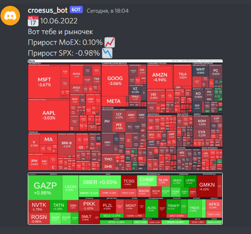

# Croesus_bot
## Описание 
Данный бот делает скриншоты карт индексов SP500 и MOEX и отправляет их в соответствующие чаты на дискорд сервере. Данные берутся с сайтов:
>https://smart-lab.ru/q/map/

>https://finviz.com/map

Пример работы бота:

Для запуска необходимо создать файл config.yaml и положить его в папку с проктом. Файл имеет слудующую структуру:

    settings = {'token': '<Токен вашего бота>',
                'bot': '<Имя приложения>',  
                'id': <id бота>,    
                'prefix': '!',
                }

Далее необходимо установить зависимости из requirments.txt

    pip install -r requirements.txt

После запуска необходимо прописать команду !create_fins для создания чатов по каждому отчётному периоду. Результат выглядит так:

Cписок доступных команд !help

